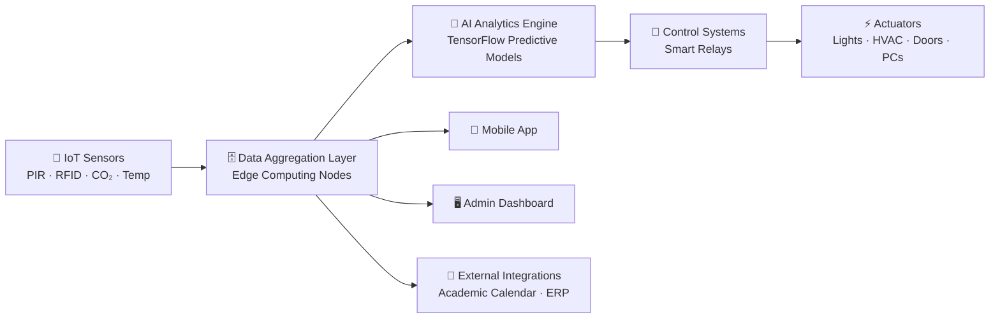

# Comprehensive-Smart-Campus-Resource-Optimization-System
# 🏛️ Smart Campus Resource Optimization System

> An IoT-enabled, AI-powered platform for intelligent energy and space management across university campuses.


## 📑 Table of Contents

1. [Executive Summary](#-executive-summary)
2. [Problem Statement](#-problem-statement)
3. [Proposed Solution](#-proposed-solution)
4. [Core Features](#-core-features)
5. [System Architecture](#-system-architecture)
6. [Tech Stack](#-tech-stack)
7. [Sensor Deployment Strategy](#-sensor-deployment-strategy)
8. [Implementation Timeline](#-implementation-timeline)
9. [Financial Analysis & ROI](#-financial-analysis--roi)
10. [Budget Breakdown](#-budget-breakdown)
11. [Risk Assessment](#-risk-assessment)
12. [Success Metrics](#-success-metrics)
13. [Getting Started](#-getting-started)
14. [Roadmap](#-roadmap)
15. [Contributing](#-contributing)
16. [License](#-license)

---

## 📋 Executive Summary

The **Smart Campus Resource Optimization System** is a comprehensive IoT-powered platform designed to automatically manage and optimize the utilization of university facilities — classrooms, laboratories, and administrative spaces. It combines artificial intelligence, real-time sensor data, and predictive analytics to drive down energy consumption, improve space utilization, and enhance the student experience.

| Key Benefit | Impact |
|---|---|
| 💰 Cost Savings | $500,000 – $800,000 in projected annual energy savings |
| 🌱 Environmental Impact | 35–45% reduction in energy consumption |
| ⚙️ Operations | Automated facility management with minimal human intervention |
| 🎓 Student Experience | Real-time visibility into classroom availability |
| 📊 Sustainability | Data-driven insights for long-term campus planning |

**Investment required:** $1.2M – $1.5M · **Implementation timeline:** 6 months · **ROI timeline:** 18–24 months

---

## ❗ Problem Statement

Universities lose significant money and operational efficiency to facility mismanagement:

**Energy inefficiency**
- Lights, fans, and AC are routinely left on in empty classrooms
- Unattended lab computers consume electricity around the clock
- No automated HVAC control for unused spaces
- Estimated annual waste: **$600,000 – $1,000,000**

**Space utilization challenges**
- Students struggle to locate available classrooms
- Administrators lack real-time occupancy visibility
- Scheduling conflicts arise from poor occupancy data

**Operational burden**
- Manual facility checks are required from maintenance staff
- Inconsistent enforcement of "lights off / doors closed" policy
- No reliable data to inform facility expansion decisions

---

## 💡 Proposed Solution

The platform integrates **IoT sensors**, an **AI analytics engine**, and **automated controls** into a single intelligent facility-management ecosystem. It continuously monitors occupancy, automatically governs lighting and climate control, and surfaces real-time data for campus operations teams.

**Core components**

| Component | Description |
|---|---|
| IoT Sensor Network | Motion sensors, occupancy detectors, CO₂ sensors, environmental monitors |
| AI Analytics Engine | TensorFlow-based predictive models for occupancy forecasting |
| Automated Control Systems | Smart relays controlling lights, fans, doors, and HVAC |
| Mobile Application | Real-time classroom availability for students and faculty |
| Admin Dashboard | Centralized insights and manual override controls for facility managers |

---

## ⚙️ Core Features

### 1. Intelligent Occupancy Detection
- PIR (Passive Infrared) motion sensors in every classroom
- Thermal imaging + CO₂ analysis for advanced occupancy detection
- Real-time occupancy status streamed to a central database
- Automatic door locking when zero occupancy is detected, with emergency override for authorized personnel

### 2. Intelligent Lighting Control
- Lights auto-off within **5 minutes** of last detected motion
- Lights auto-on when motion resumes
- Daylight-responsive dimming via ambient light sensing
- LED retrofit with smart ballasts campus-wide

### 3. HVAC & Fan Management
- Fans/AC auto-off **10 minutes** after a space becomes unoccupied
- Auto-restart **15 minutes** before scheduled lecture start
- CO₂- and temperature-triggered ventilation based on occupancy
- Predictive maintenance alerts for HVAC filter replacement

### 4. Laboratory Computer Management
- Lab computers auto-shutdown **5 minutes** after inactivity is detected
- Wake-on-LAN boot **30 minutes** before scheduled lab sessions
- Per-machine real-time power consumption tracking
- Remote emergency shutdown from the admin dashboard

### 5. Teacher Detection & Classroom Status
- RFID badge readers log entry/exit times at every classroom door
- Academic-calendar integration: doors unlock and lights/AC activate **10 minutes** before a scheduled lecture, and power down **5 minutes** after it ends
- Daily/weekly occupancy reports highlight underutilized classes for consolidation

### 6. Student-Facing Mobile App
- Real-time view of available classrooms and study spaces
- In-app booking for study spaces and meeting rooms
- Indoor wayfinding/navigation to available spaces
- Push notifications for room status and booking reminders

### 7. Facility Manager Dashboard
- Live campus-wide occupancy heatmap
- Energy analytics broken down by building, floor, and room
- Maintenance alerts and equipment health monitoring
- Historical trends, predictive analytics, and emergency override controls

---

## 🏗️ System Architecture

The platform follows a linear data pipeline — sensors feed a central aggregation layer, which is processed by the AI engine and translated into physical actions via the control layer, while surfacing insights through the app and dashboard.



**Data flow summary**

| Stage | Function |
|---|---|
| IoT Sensors | Capture raw occupancy, motion, RFID, and environmental signals |
| Data Aggregation Layer | Collects and pre-processes sensor data at the edge (per 10-classroom zone) |
| AI Analytics Engine | Forecasts occupancy and generates control decisions |
| Control Systems | Translates AI decisions into relay commands |
| Actuators | Physically execute actions — lights, HVAC, door locks, lab PCs |
| Mobile App / Admin Dashboard | Consume aggregated data for end-user visibility and management |

---

## 🛠️ Tech Stack

| Layer | Technology | Notes |
|---|---|---|
| Sensors | IoT Hardware | PIR motion, RFID, CO₂, temperature |
| Backend | Python | Data processing & API layer |
| Analytics | TensorFlow | AI/ML predictive occupancy models |
| Database | PostgreSQL | Real-time + historical data store |
| Integration | REST API | Connects to third-party/university systems |
| Mobile App | React Native | iOS & Android |
| Admin Dashboard | React.js | Web-based control interface |
| Control Systems | Smart Relays | 12V / 24V automated switching |
| Cloud | AWS / Azure | Optional — backup & extended analytics |

---

## 📍 Sensor Deployment Strategy

- **Motion sensors:** 2–3 per classroom, mounted at ceiling corners
- **RFID readers:** mounted at each classroom entrance/exit
- **Environmental sensors:** 1 CO₂/temperature/humidity unit per room
- **Smart relays:** integrated into existing lighting circuits and HVAC systems
- **Edge computing devices:** local processing covering 10-classroom zones

---

## 🗓️ Implementation Timeline

```mermaid
gantt
    title Implementation Roadmap (26 Weeks)
    dateFormat  W
    axisFormat  Wk %s
    section Phase 1
    Planning & Design        :p1, 1, 4w
    section Phase 2
    Pilot Program (50+ rooms) :p2, after p1, 8w
    section Phase 3
    Full Campus Rollout      :p3, after p2, 8w
    section Phase 4
    Optimization & Support   :p4, after p3, 6w
```



| Phase | Duration | Timeline | Key Deliverables |
|---|---|---|---|
| 1. Planning & Design | 4 weeks | Weeks 1–4 | Design docs, sensor deployment maps |
| 2. Pilot Program | 8 weeks | Weeks 5–12 | 5 buildings / 50+ classrooms live, feedback loop |
| 3. Full Rollout | 8 weeks | Weeks 13–20 | Campus-wide deployment, mobile app & dashboard launch |
| 4. Optimization & Support | 6 weeks | Weeks 21–26 | Tuning, training, documentation, ongoing support model |

<details>
<summary><strong>Expand phase details</strong></summary>

**Phase 1 — Planning & Design (Weeks 1–4)**
- Facility audit and existing-infrastructure assessment
- System architecture tailored to campus layout
- Integration plan with existing university systems
- Detailed sensor deployment maps

**Phase 2 — Pilot Program (Weeks 5–12)**
- Sensor installation across 5 pilot buildings (50+ classrooms)
- AI analytics engine deployment
- Beta testing with a limited user group
- Feedback collection and algorithm tuning

**Phase 3 — Full Rollout (Weeks 13–20)**
- Campus-wide sensor deployment
- University-wide activation of automated controls
- Mobile app and admin dashboard launch
- Complete staff training

**Phase 4 — Optimization & Support (Weeks 21–26)**
- Performance tuning and algorithm refinement
- Intensive user support and issue resolution
- Documentation and knowledge transfer
- Establishment of ongoing maintenance protocols

</details>

---

## 💵 Financial Analysis & ROI

**Annual cost savings**

| Cost Category | Annual Savings |
|---|---|
| Energy consumption (35% reduction) | $600,000 |
| Labor cost (40% reduction) | $120,000 |
| Equipment maintenance | $50,000 |
| Space utilization optimization | $80,000 |
| **Total annual savings** | **$850,000 – $1,050,000** |

**5-year ROI projection**

| Year | Cost / Benefit | Net ROI |
|---|---|---|
| Year 1 | -$1,350,000 | -$1,350,000 |
| Year 2 | +$925,000 | -$425,000 (payback in progress) |
| Year 3 | +$925,000 | +$500,000 |
| Year 4 | +$925,000 | +$1,425,000 |
| Year 5 | +$925,000 | +$2,350,000 |

---

## 💰 Budget Breakdown

| Budget Item | % of Total | Cost |
|---|---|---|
| IoT Hardware (sensors, relays, readers) | 30% | $405,000 |
| Software Development | 25% | $337,500 |
| System Integration & Installation | 20% | $270,000 |
| Staff Training & Change Management | 10% | $135,000 |
| Project Management & Consulting | 10% | $135,000 |
| Contingency | 5% | $67,500 |
| **Total Project Budget** | **100%** | **$1,350,000** |

---

## ⚠️ Risk Assessment

| Risk | Probability | Impact | Mitigation |
|---|---|---|---|
| User resistance | Medium | Medium | Change management & training programs |
| Integration complexity | Low | High | Early vendor assessment |
| Budget overrun | Low | Medium | Detailed cost estimates + contingency fund |
| Technical delays | Low | Medium | Experienced team, phased pilot approach |
| Data privacy concerns | Medium | Medium | Robust security architecture, compliance review |

---

## 🎯 Success Metrics

- Energy consumption reduced by **at least 35%** within 12 months
- **95%** system uptime for classroom availability visibility
- Staff operational burden reduced by **40%**
- **75%+** mobile app adoption rate within 6 months
- Positive ROI achieved within **18–24 months**

**Strategic benefits beyond cost savings:** enhanced sustainability reputation, improved student experience, demonstrable carbon-reduction commitment, data-driven campus expansion planning, and reduced staff workload on repetitive facility tasks.

---

## 🚀 Getting Started

> The sections below describe the intended setup for the engineering team once development begins.

### Prerequisites
- Python 3.10+
- Node.js 18+ (for the React.js dashboard and React Native app)
- PostgreSQL 14+
- TensorFlow 2.x
- Access to IoT sensor gateway / edge device SDKs

### Installation
```bash
# Clone the repository
git clone https://github.com/your-org/smart-campus-resource-optimization.git
cd smart-campus-resource-optimization

# Backend setup
cd backend
python -m venv venv && source venv/bin/activate
pip install -r requirements.txt

# Configure environment variables
cp .env.example .env
# Edit .env with your PostgreSQL and sensor gateway credentials

# Run database migrations
python manage.py migrate

# Start the backend API
python manage.py runserver
```

```bash
# Dashboard setup
cd ../dashboard
npm install
npm run dev
```

```bash
# Mobile app setup
cd ../mobile-app
npm install
npx react-native run-android   # or run-ios
```

### Configuration
Sensor gateways, relay IDs, and academic calendar integration endpoints are configured per-building in `config/buildings.yaml`. See `docs/deployment-guide.md` for full sensor-mapping instructions (to be added as the pilot program data becomes available).

---

## 🗺️ Roadmap

- [ ] Complete facility audit and technical assessment
- [ ] Form cross-functional steering committee (IT, Facilities, Finance)
- [ ] Run vendor evaluation / RFP process
- [ ] Launch Phase 2 pilot across 5 buildings
- [ ] Full campus rollout
- [ ] Post-launch optimization and long-term support handoff

---

## 🤝 Contributing

This repository is currently in the proposal/pre-implementation stage. Once development kicks off, contribution guidelines (branching strategy, code style, PR review process) will be published in `CONTRIBUTING.md`. Stakeholders interested in the pilot program should reach out to the project steering committee.

---

## 📄 License

This project is proposed under the MIT License. See `LICENSE` for details once the repository is finalized.

---

**Recommended decision:** Proceed with RFP and vendor evaluation.
**Expected implementation window:** Summer 2024 – Winter 2024.
